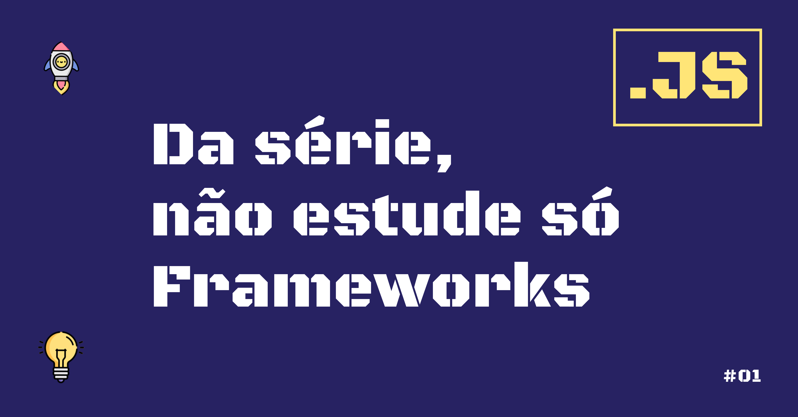

# Da série, não estude só Frameworks.

  

## Sobre o Projeto 🔥

Este repositório é dedicado à ideia central de que, antes de se aventurar no vasto universo de frameworks e bibliotecas, é fundamental entender e dominar a linguagem de programação subjacente: neste caso, **JavaScript**.

## Por que focar primeiro no JavaScript?

1° Compreensão Profunda: Entender o núcleo da linguagem proporciona uma base sólida para aprender qualquer framework ou biblioteca baseada em **JavaScript**.

2° Adaptabilidade: Os frameworks vêm e vão. Mas, com um conhecimento sólido de **JavaScript**, você estará preparado para adaptar-se a novas ferramentas e tecnologias.

3° Independência: Dominar o **JavaScript** permite que você vá além dos recursos padrão dos frameworks, possibilitando a criação de soluções mais personalizadas e inovadoras.

## 🤝 Contribuição

Sinta-se à vontade para contribuir com este projeto! Se você tem um guia, um tutorial ou qualquer outro recurso educacional sobre  **JavaScript** puro, adoraríamos incluí-lo aqui.

Conecte-se conosco
